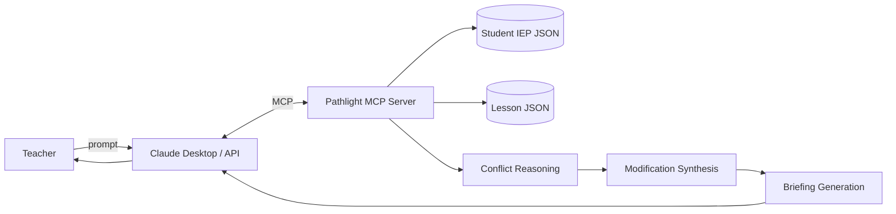
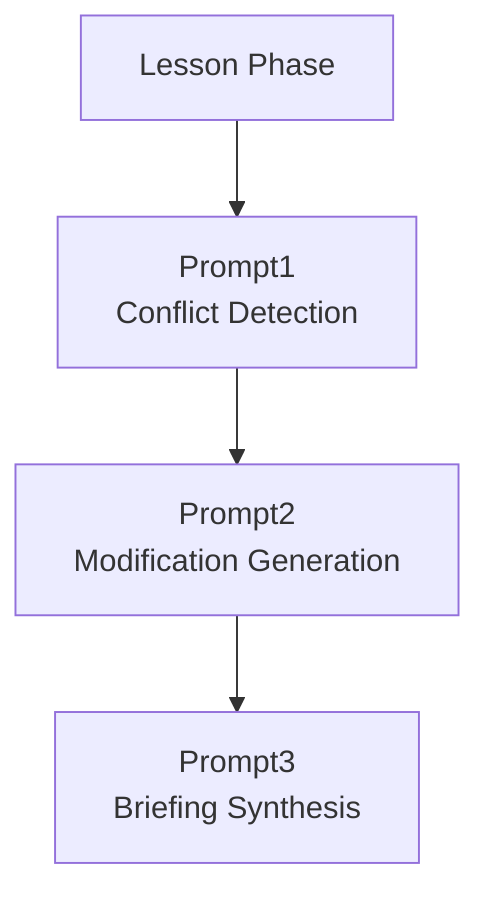
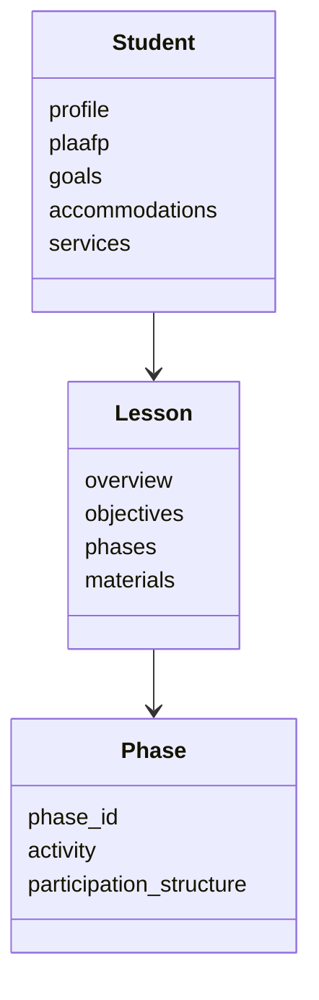
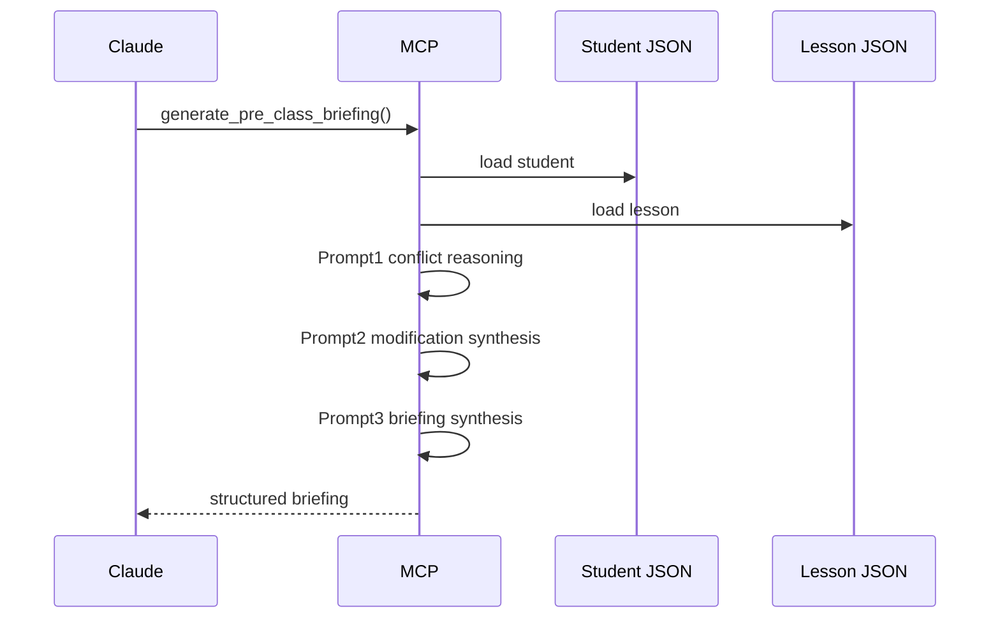

# ARCHITECTURE.md

## Overview

Pathlight is an MCP-based instructional accessibility reasoning system.

The system analyzes lesson phases against a student's IEP profile to identify instructional barriers, generate classroom-accessible supports, and synthesize teacher-facing lesson briefings.

The current prototype focuses on:

- single student
- single lesson
- phase-level instructional reasoning
- structured LLM pipelines

---

## System Context



---

## Core Pipeline



---

## Reasoning Layers

### Prompt1 — Instructional Conflict Detection

Goal:

Identify meaningful instructional accessibility barriers.

Reasoning pattern:

```text
Instructional Demand
vs
Student Functional Barrier
→ Instructional Conflict
```

Current conflict taxonomy:

- cognitive_load
- behavioral_regulation_stamina
- response_demand
- participation_structure
- task_independence
- modality_access

Output:

```json
{
  "phase_id": "independent_practice",
  "conflict_type": "cognitive_load",
  "evidence": "...",
  "severity": "high",
  "iep_anchor": "..."
}
```

---

### Prompt2 — Modification Synthesis

Goal:

Generate scalable classroom supports that preserve lesson rigor while improving accessibility.

Grounding:

- UDL
- scaffolded instruction
- multimodal representation
- executive functioning supports
- structured participation
- comprehension scaffolds

Constraints:

- preserve lesson integrity
- avoid over-intervention
- preserve independence when possible
- avoid continuous teacher prompting

Output:

```json
{
  "phase_id": "independent_practice",
  "conflict_ref": ["cognitive_load", "response_demand"],
  "modification_strategy": "...",
  "implementation_steps": [],
  "expected_outcome": "...",
  "iep_anchor": []
}
```

---

### Prompt3 — Briefing Synthesis

Goal:

Compress modifications into concise teacher-facing execution guidance.

Output includes:

- priority concerns
- phase risks
- teacher actions
- materials needed
- monitoring focus

Example:

```text
Independent Practice
- Use chunked response scaffolds
- Provide graphic organizer
- Monitor stamina during written response
```

---

## Domain Model



---

## Data Flow



---

## Current Challenges

- instructional conflict over-detection
- support repetition across phases
- phase amplification
- preserving instructional integrity
- reducing generic reasoning patterns in smaller models
- support deduplication
- conflict prioritization

---

## Current Architecture Decisions

### JSON-first Runtime

Runtime only reads structured JSON.

PDF parsing is handled offline during ingest.

Benefits:

- faster runtime
- deterministic context
- easier debugging
- stable grounding

---

### Phase-Level Reasoning

All reasoning is phase-aware.

Benefits:

- teacher-aligned workflow
- localized instructional supports
- reduced generic accommodations

---

### Structured Generation

All LLM outputs are validated through structured schemas.

Benefits:

- downstream consistency
- predictable pipeline behavior
- easier evaluation

---

## Project Structure

```text
src/pathlight/
├── server.py
├── models.py
├── llm/
├── services/
│   ├── conflicts/
│   ├── modifications/
│   └── briefing/
├── prompts/
├── resources/
└── shared/
```

---
