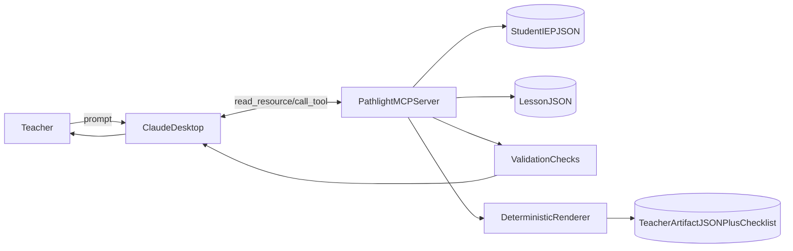
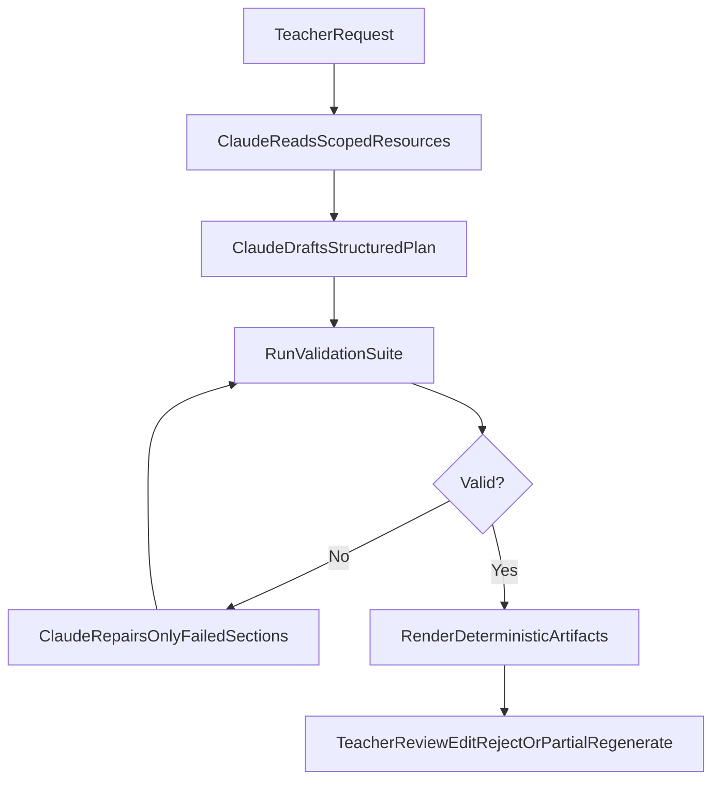
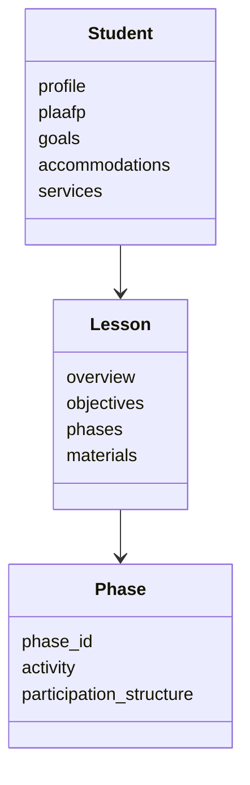
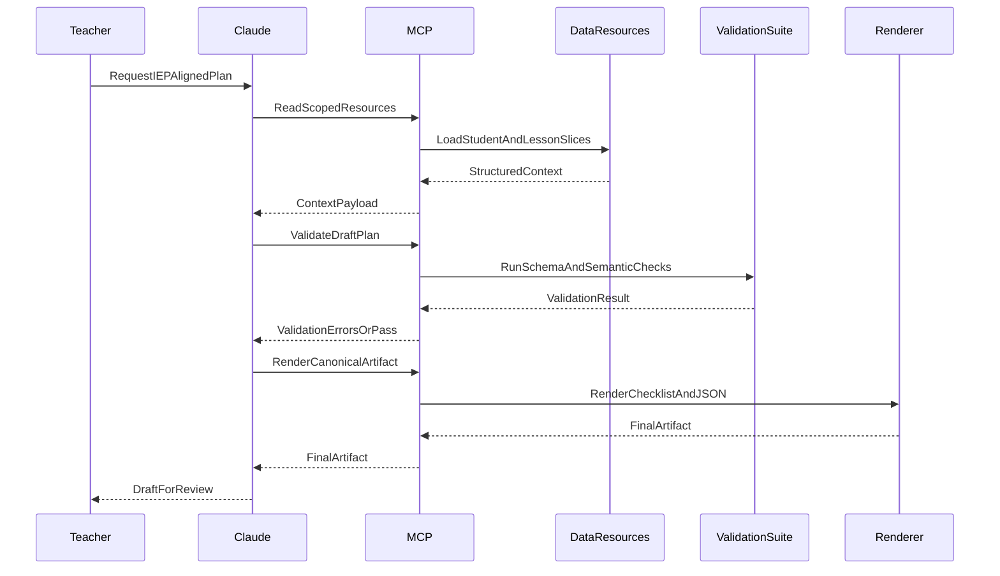

# ARCHITECTURE.md

## Overview

Pathlight is an MCP-based instructional accessibility reasoning system.

The system analyzes lesson phases against a student's IEP profile to identify instructional barriers, generate classroom-accessible supports, and synthesize teacher-facing lesson briefings.

The current prototype focuses on:

- single student
- single lesson
- phase-level instructional reasoning
- structured LLM pipelines

---

## Why This Migration

Pathlight is migrating from a server-side multi-step LLM workflow to a Claude-native MCP interaction model.

This is a technical decision focused on system boundaries and reliability:

- **Native model reasoning boundary**: Claude should perform lesson-IEP reasoning directly, while MCP serves context and contracts. This reduces hidden model logic inside backend orchestration and makes behavior easier to inspect in the user-facing loop.
- **Deterministic output artifacts**: final teacher deliverables should be renderer-controlled artifacts (schema-backed JSON and deterministic checklist rendering), not free-form prose.
- **Reproducible behavior**: separating context serving, validation, and rendering improves replayability and debugging across runs.
- **Validation as a first-class layer**: semantic checks (grounding, accommodation coverage, lesson-question references, unsupported output detection) sit between draft generation and final artifact acceptance.
- **Human-in-the-loop control**: teacher editing, rejection, and partial regeneration become explicit workflow primitives rather than ad hoc prompt behavior.

This migration preserves existing domain modeling work (IEP parsing, lesson structure, phase-aware reasoning) while changing the runtime contract to be MCP-first and deterministic by default.

---

## System Context



---

## Core Pipeline



---

## Reasoning Layers

### Layer 1 — Context Acquisition (MCP Resources)

Goal:

Provide predictable, scoped context to Claude with stable IDs.

Core resources:

- student profile, PLAAFP, goals, accommodations
- lesson overview, phases, formative questions, materials
- scoped slices for phase-level reads

```text
student://{id}/...
lesson://{id}/...
phase://{lesson_id}/{phase_id}/...
```

Design constraints:

- phase-based split
- predictable IDs
- scoped reads to avoid context bloat

---

### Layer 2 — Native Claude Reasoning

Goal:

Claude performs lesson-IEP intersection reasoning directly and drafts a structured plan.

Expected draft structure:

```text
before_class_checklist
phase_actions
scaffolded_questions (linked to lesson question IDs)
accommodation_reminders (linked to source references)
```

---

### Layer 3 — Validation and Repair Loop

Goal:

Enforce contract compliance before output acceptance.

Validation categories:

- schema validity
- IEP grounding checks
- accommodation coverage checks
- lesson-question reference checks
- unsupported output detection

Repair behavior:

- validation returns structured errors
- Claude regenerates only failing sections
- accepted sections remain unchanged

---

### Layer 4 — Deterministic Artifact Rendering

Goal:

Produce canonical, reproducible teacher outputs independent from prose variability.

Canonical artifacts:

- structured JSON deliverable
- deterministic checklist markdown

Implementation (Phase 4):

- contract: `schemas/deliverable.py` (`TeacherDeliverable`) — Pydantic source of truth
- renderer: `schemas/rendering.py` (`render_teacher_markdown`) — pure, order-preserving
- tool entrypoint: `render_teacher_artifact` in `tools/registry.py` validates the
  draft and returns canonical JSON + rendered markdown (deterministic, no LLM,
  always registered alongside legacy gating)

---

## Domain Model



---

## Data Flow



---

## Current Challenges

- balancing scoped context completeness vs token efficiency
- minimizing unsupported or invented output from draft generation
- preserving accepted sections during partial regeneration
- keeping deterministic rendering aligned with evolving schema
- maintaining validation precision without over-rejecting usable drafts
- documenting reproducible runs with stable example artifacts

---

## Current Architecture Decisions

### JSON-first Runtime

Runtime only reads structured JSON.

PDF parsing is handled offline during ingest.

Benefits:

- faster runtime
- deterministic context
- easier debugging
- stable grounding

---

### Claude-Native Reasoning Boundary

Primary lesson-IEP reasoning is performed by Claude, not hidden backend prompt chains.

Benefits:

- clearer runtime boundary and responsibilities
- easier user-facing inspection and iteration
- reduced backend orchestration complexity

---

### Validation-First Acceptance

Drafts must pass schema + semantic validation before acceptance.

Benefits:

- stronger grounding and safety guarantees
- machine-checkable quality gates
- tighter reproducibility across runs

---

### Deterministic Rendering

Final deliverables are renderer-controlled artifacts. Claude drafts the JSON;
`render_teacher_artifact` validates it against `TeacherDeliverable` and emits a
stable markdown checklist via `render_teacher_markdown`.

Benefits:

- stable teacher-facing format
- easier diffing and regression testing
- reduced dependence on prose formatting behavior

---

### Human-in-the-Loop by Design

Teacher controls are explicit primitives: edit, reject, partial regenerate.

Benefits:

- practical classroom ownership
- safer AI-assisted planning workflow
- clearer separation between AI draft and human acceptance

---

## Project Structure

```text
src/pathlight/
├── server.py
├── models.py          # Data primitives (Lesson, Student)
├── resources/         # Shape A: stateless context providers (IEP/Lesson data)
├── tools/             # Shape A: validation + renderer entrypoints (tool gate)
├── prompts/           # Shape A: Claude-native workflow prompts
├── schemas/           # Shape A: strict output contracts and artifact definitions
├── legacy/            # v0 tombstone modules (not in default v1 runtime path)
│   ├── conflicts/
│   ├── modifications/
│   └── workflow/
└── shared/            # Serialization and cross-cutting helpers
```

### Runtime Ownership (Shape A)

- **Primary runtime path**: `server.py` + `resources/` + `tools/` + `prompts/` + `schemas/`
- **Migration legacy path**: `legacy/conflicts/`, `legacy/modifications/`, `legacy/workflow/`
- **Data contracts**: `models.py` for domain primitives and `schemas/` for artifact contracts
- **Shared utilities**: `shared/` for serialization and cross-cutting helpers
- **v1 registration rule**: `server.py` defaults to registering only Shape A resources/tools/prompts; legacy modules are bypassed unless explicitly enabled for experiments.

---
