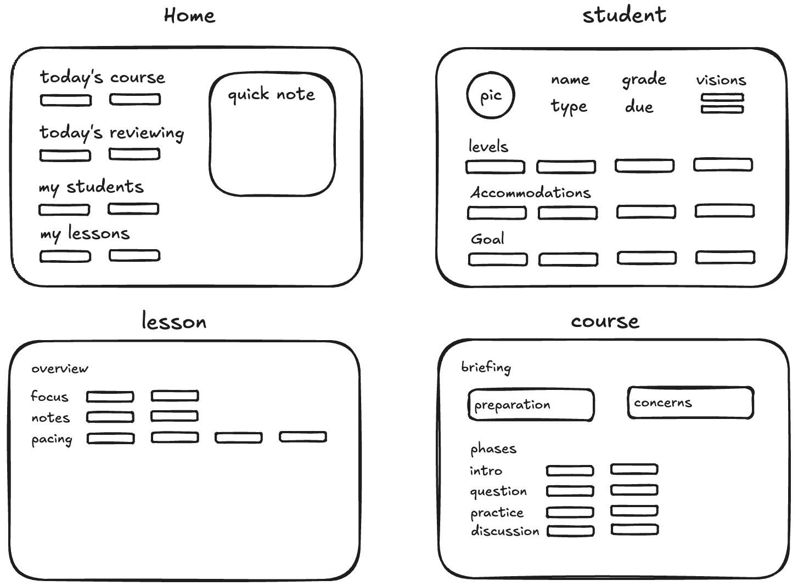

# Pathlight

AI-powered instructional accessibility reasoning for IEP-aligned lesson adaptation.

## Overview

Pathlight analyzes lesson phases against a student's IEP profile to identify instructional accessibility barriers and generate teacher-facing classroom supports.

The system focuses on instructional reasoning rather than generic accommodation matching.

## Problem

Teachers frequently adapt lessons manually, but:

- IEP implementation is inconsistent
- accommodations are often generic or disconnected from lesson context
- instructional accessibility reasoning is time-consuming
- phase-specific learning barriers are difficult to operationalize in real classrooms

## What the System Does

For each lesson phase, the system:

1. Detects instructional conflicts
2. Generates instructional modifications
3. Produces teacher-facing pre-class briefings

The pipeline attempts to preserve lesson rigor while improving instructional accessibility.

## Example Workflow

```txt
Lesson Phase
→ Instructional Conflict Detection
→ Accessibility Modification Generation
→ Teacher Briefing Synthesis
```

## Concept UI Sketch

Early workflow concepts for teacher-facing lesson accessibility planning.



## Worked Example

Student: jasmine_bailey (G7, Health Impairment, ELA standards-grade 1.8 / iReady reading G3, Math G4)

Lesson: community_lowe (RI.7.2, 45 min, 4 phases)

Phase:
`independent_practice`

Detected conflict:

```json
{
  "conflict_type": "cognitive_load",
  "severity": "high",
  "evidence": "Difficulty answering inferential questions independently."
}
```

Generated modification:

```json
{
  "modification_strategy": "Chunked written response scaffold",
  "implementation_steps": [
    "Provide graphic organizer",
    "Use sentence starters",
    "Break response into smaller sections"
  ]
}
```

Teacher briefing:

```text
BEFORE BELL
- [ ] Seat Jasmine in front row              (Acc: Sit in front of the room, p.18)

INTRO (0–5 min)

DURING READING (5–20 min)
- [ ] Hand Jasmine the simplified version of paragraphs 1–3 first
                                             (Conflict #1: PLAAFP reading G3 vs lesson G7)
- [ ] Repeat directions verbally before each During Reading Question
                                             (Acc: Repeat directions, p.18)

INDEPENDENT PRACTICE (20–40 min)
- [ ] Direct her to use the 3-column organizer (Claim / Evidence / Analysis)
- [ ] Set checkpoints at minute 7 and minute 14
                                             (Acc: Reminders to pause, plan, proceed, p.18)

DISCUSSION (40–45 min)
- [ ] Offer regular breaks for small-group or quiet activities to help Jasmine stay engaged.
                                             (Acc: Small group (as needed), p.18)
- [ ] Give Jasmine 1-min advance notice that she'll share first answer
                                             (PLAAFP behavioral: cold-call avoidance, p.10)
```

## Core Concepts

### Instructional Conflicts

An instructional conflict represents:

```txt
instructional demand
vs
student functional barrier
```

Current conflict taxonomy:

- cognitive_load
- behavioral_regulation_stamina
- response_demand
- participation_structure
- task_independence
- modality_access

### Instructional Modifications

Evidence-based classroom adaptations grounded in:

- Universal Design for Learning (UDL)
- scaffolded instruction
- multimodal representation
- structured participation
- executive functioning supports
- comprehension scaffolds

The system prioritizes scalable classroom supports while preserving lesson integrity and academic rigor.

### Pre-Class Briefing

Teacher-facing execution guidance including:

- priority concerns
- phase risks
- instructional actions
- materials needed
- monitoring focus

## Architecture

```txt
Student IEP
→ lesson phase analysis
→ instructional conflict reasoning
→ modification synthesis
→ briefing generation
```

See [ARCHITECTURE.md](ARCHITECTURE.md) for detailed system design.

## Example Output

[35110GST_community_during_reading](examples/jasmine_community_output.json)

## Tech Stack

- Python 3.11
- MCP Python SDK
- Pydantic v2
- Groq / Anthropic
- Structured JSON generation

## Current Scope

Current prototype limitations:

- single student
- single lesson
- phase-level reasoning
- prompt-driven inference

## Future Directions

### Instructional Reasoning

- retrieval-based IEP context selection
- instructional prioritization and ranking
- conflict confidence scoring
- support deduplication across lesson phases
- cognitive demand modeling
- hybrid symbolic + LLM reasoning
- reduced over-detection and phase amplification

### Scaffolded Question Generation

- Bloom-aligned question ladders
- IEP-aware sentence starters
- accessibility-aware exemplar responses
- adaptive comprehension scaffolds
- visual support generation
- phase-aware guided questioning

### Evaluation & Reliability

- evaluation datasets and regression testing
- structured teacher feedback loops
- instructional quality scoring
- grounding validation for IEP evidence
- cross-model benchmarking

### Multi-Student & Classroom Support

- multi-student lesson adaptation
- classroom-level accessibility planning
- grouped accommodation synthesis
- instructional support clustering

### Teacher Workflow & UX

- printable teacher cheat sheets
- classroom-ready lesson adaptation views
- pre-class preparation workflows
- lightweight teacher review UI
- lesson accessibility dashboards
- classroom implementation analytics

### Infrastructure

- caching and async orchestration
- model routing by reasoning complexity
- retrieval pipelines
- structured evaluation telemetry
- local-first / FERPA-aware deployment

## Running Locally

### 1. Create virtual environment

```bash
python3 -m venv .venv
source .venv/bin/activate
```

### 2. Install dependencies

```bash
pip install -e .
```

### 3. Claude Desktop config

#### macOS

`~/Library/Application Support/Claude/claude_desktop_config.json`

#### Windows

`%APPDATA%\Claude\claude_desktop_config.json`

### macOS / Linux example

```json
{
  "mcpServers": {
    "pathlight": {
      "command": "/Users/username/path_to_project/.venv/bin/python3",
      "args": ["-m", "src.pathlight.server"]
    }
  }
}
```

### Windows example

```json
{
  "mcpServers": {
    "pathlight": {
      "command": "C:\\Users\\username\\path_to_project\\.venv\\Scripts\\python.exe",
      "args": ["-m", "src.pathlight.server"]
    }
  }
}
```

Optional environment variables:

```bash
ANTHROPIC_API_KEY=...
GROQ_API_KEY=...
```

### 4. Restart Claude Desktop

### MCP Inspector

```bash
npx @modelcontextprotocol/inspector python3 -m src.pathlight.server
```
