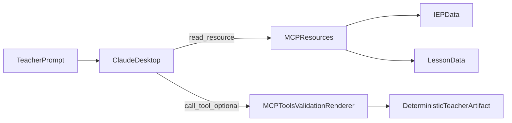

# Pathlight

Pathlight is an MCP server for IEP-grounded lesson adaptation.

This README defines the **Shape A** v1 contract:
- Claude is the primary reasoning engine.
- MCP provides structured context, validation, and deterministic rendering.
- The output is a teacher-usable draft artifact, not free-form prose.

## Problem

Teachers often receive long IEPs and need to adapt tomorrow's lesson quickly.
Most AI outputs are either generic accommodations or unstructured text that is hard to use in class.

Pathlight focuses on one practical goal: produce a grounded, editable teacher draft for one lesson and one student.

## Product Contract (Shape A)

### Responsibilities

- **Claude**: reason over lesson + IEP, draft modifications, and revise from validation feedback.
- **MCP server**: expose resources, enforce output contract, run validation checks, and render deterministic artifacts.

### Data Flow



## Entry Point: `analyze_student_lesson` Prompt

The default path is the MCP prompt `analyze_student_lesson` (Claude-first).
It instructs Claude to:
1. read scoped MCP resources first,
2. draft a structured teacher deliverable (not prose),
3. self-validate (grounding, accommodation coverage, lesson-question references,
   no unsupported output) before finalizing,
4. treat output as a draft that supports edit / reject / partial regeneration.

### Legacy server-side workflow (disabled by default)

The earlier server-side LLM tools (`detect_conflicts`, `generate_modifications`,
`generate_pre_class_briefing`, `generate_instructional_plan`) are legacy
experiments. They are not registered and cannot be dispatched unless explicitly
enabled:

```bash
PATHLIGHT_ENABLE_LEGACY_TOOLS=1
```

Accepted truthy values (case-insensitive): `1`, `true`, `yes`, `on`. Any other
value (or unset) leaves the legacy tools disabled.

## v1 Scope Freeze

Pathlight v1 intentionally targets:
- one student
- one lesson
- one high-quality teacher deliverable

This is deliberate to maximize output quality and reproducibility.

## v1 Deliverable (Phase 4)

The canonical output is a **renderer-controlled artifact** with:
- before-class checklist
- phase-specific teacher actions
- scaffolded questions tied to lesson question IDs
- accommodation reminders with source references

Claude drafts the content, but the final structure is controlled by a strict
schema + a deterministic renderer:

- **Output contract**: `src/pathlight/schemas/deliverable.py` (`TeacherDeliverable`)
  is the Pydantic source of truth for the artifact shape.
- **Deterministic renderer**: `src/pathlight/schemas/rendering.py`
  (`render_teacher_markdown`) turns a validated draft into a stable,
  order-preserving markdown checklist. Same input always yields the same
  artifact (diffable, reproducible, testable).
- **Tool entrypoint**: the `render_teacher_artifact` MCP tool validates the
  draft against the contract and returns both the canonical JSON and the
  rendered markdown. It is deterministic (no server-side LLM) and always
  registered. Claude calls it in Step 4 of `analyze_student_lesson` after
  self-validation, so the final deliverable never depends on free-form prose.

Draft JSON shape:

```json
{
  "student_id": "...",
  "lesson_id": "...",
  "before_class_checklist": [
    {"action": "...", "accommodation_ref": "acc_xx (p.NN)"}
  ],
  "by_phase": [
    {
      "phase_id": "...",
      "teacher_actions": ["..."],
      "scaffolded_questions": [
        {"question_id": "qN", "original": "...", "scaffolded": "..."}
      ],
      "accommodation_reminders": [
        {"label": "...", "source": "acc_xx (p.NN)"}
      ]
    }
  ]
}
```

## Validation Contract

v1 validation is multi-layered (not schema-only):
- schema validity checks
- IEP grounding checks
- accommodation coverage checks
- lesson-question reference checks
- unsupported output detection

Validation errors are structured so Claude can self-correct or request teacher input.

## Resource Contract (Phase 2)

Pathlight now exposes segmented, predictable resources for scoped Claude reads.

- Backward-compatible full resources:
  - `student://{id}/full`
  - `lesson://{id}/full`
- Student segmented resources:
  - `student://{id}/profile`
  - `student://{id}/plaafp`
  - `student://{id}/plaafp/{section_id}`
  - `student://{id}/goals`
  - `student://{id}/goals/{goal_id}`
  - `student://{id}/accommodations`
  - `student://{id}/accommodations/{acc_id}`
  - `student://{id}/services`
  - `student://{id}/assessment_accommodations`
  - `student://{id}/key_dates`
  - `student://{id}/scopes/instructional_core`
- Lesson segmented resources:
  - `lesson://{id}/overview`
  - `lesson://{id}/phases`
  - `lesson://{id}/phases/{phase_id}`
  - `lesson://{id}/questions/{question_id}`
  - `lesson://{id}/scopes/phase/{phase_id}`
- Cross-resource scoped read (one read, no context bloat):
  - `student://{id}/scopes/lesson/{lesson_id}/phase/{phase_id}`

### Scoped read in `student://{id}/scopes/lesson/{lesson_id}/phase/{phase_id}`

This is the primary Phase 2 scoped-read pattern: it lets Claude request
"one phase + linked questions + relevant accommodations" in a single read
instead of stitching several resources together. The slice returns:
- `lesson_overview` (Claude-grounding summary)
- `phase` (the one requested lesson phase)
- `formative_checks` (lesson questions with stable `question_id`s)
- `student_instructional_core` (profile teaching context, PLAAFP, goals, accommodations)

### Claude-grounding fields in `lesson://{id}/overview`

`lesson://{id}/overview` returns a Claude-oriented summary payload including:
- `grade`
- `subject`
- `unit_topic`
- `duration_minutes`
- `instructional_objective_summary`

### Instruction-only scope in `student://{id}/scopes/instructional_core`

This scope intentionally includes classroom-relevant fields only (profile teaching context, PLAAFP, goals, accommodations) and excludes unrelated metadata.

## Human in the Loop

AI output is draft-first.
Teacher workflow requirements:
- edit any section
- reject full draft
- regenerate only selected section(s)

Accepted sections are preserved during partial regeneration.

## Current Repository State

This repo includes:
- MCP server scaffolding and tool registry
- structured lesson and student resources
- prior workflow-oriented services and outputs (kept for reference during migration)

The active migration goal is to make Shape A the default path.

## What Is Explicitly Out of Scope (v1)

- vector retrieval and vector databases
- session memory and long-lived agent state
- multi-agent orchestration
- analytics platformization
- multi-student classroom optimization

## Example Data

- Student data: `data/students/35110GST.json`
- Lesson data: `data/lessons/community.json`
- Previous workflow outputs (reference only): `data/output/8b.json`, `data/output/70b.json`

## Architecture Notes

See [ARCHITECTURE.md](ARCHITECTURE.md) for system design details and migration context.

## Running Locally

### 1. Create virtual environment

```bash
python3 -m venv .venv
source .venv/bin/activate
```

### 2. Install dependencies

```bash
pip install -e .
```

### 3. Claude Desktop config

#### macOS

`~/Library/Application Support/Claude/claude_desktop_config.json`

#### Windows

`%APPDATA%\Claude\claude_desktop_config.json`

### macOS / Linux example

```json
{
  "mcpServers": {
    "pathlight": {
      "command": "/Users/username/path_to_project/.venv/bin/python3",
      "args": ["-m", "src.pathlight.server"]
    }
  }
}
```

### Windows example

```json
{
  "mcpServers": {
    "pathlight": {
      "command": "C:\\Users\\username\\path_to_project\\.venv\\Scripts\\python.exe",
      "args": ["-m", "src.pathlight.server"]
    }
  }
}
```

Optional environment variables:

```bash
ANTHROPIC_API_KEY=...
GROQ_API_KEY=...
```

Notes:
- During Shape A migration, external model keys are optional for context-serving and non-LLM checks.
- If you enable model-backed steps, configure provider keys accordingly.

### 4. Restart Claude Desktop

### MCP Inspector

```bash
npx @modelcontextprotocol/inspector python3 -m src.pathlight.server
```

